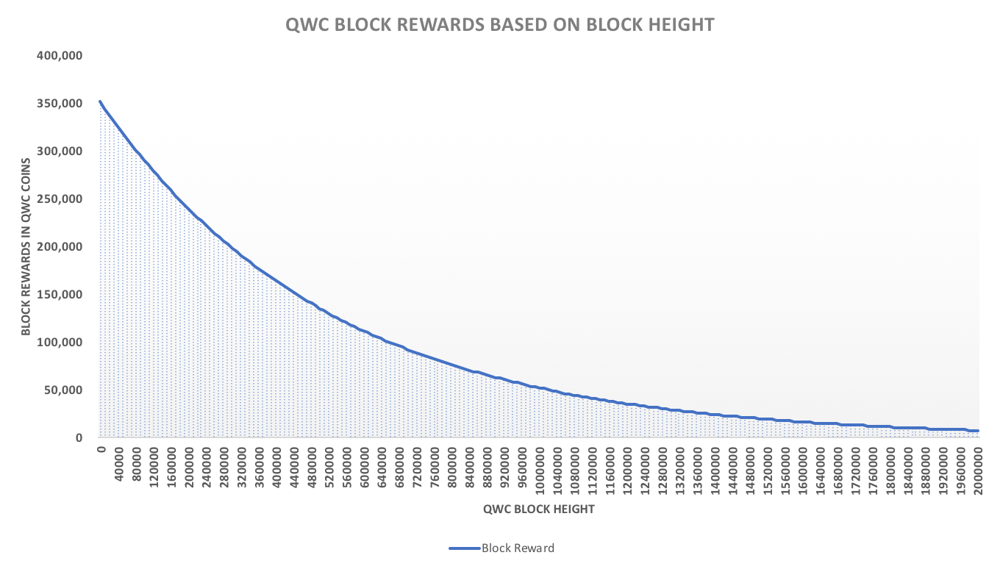

# CryptoNote Block Reward Calculation

The standard CN block reward is calculated using the following formula:

*  Block Reward = \(Total Supply of Coins - Already Generated Coins\) / \(2^emission speed factor\)

In the mathematical expression,

* BR = \(T - A\*\(10^\(number of decimals\)\)\) / \(2^19\) / \(10^\(number of decimals\)\)

For example, let's try to calculate the block reward of the genesis block.  
  
- T = \(2^64\) - 1 = 18,446,744,073,709,551,615, a constant  
- A = 0, This is a genesis block, a varible   
- emission speed factor = 19, a constant  
- number of decimals = 8, a constant  
  
Block \#1 \(18,446,744,073,709,551,615 - 0\) \* \(2^-19\) \* \(10^-8\) = 351,843.72088832 QWC  
  
For the next block, The calculation is as shown below  
  
Block \#2 \(18,446,744,073,709,551,615 - 35,184,372,088,832\) \* \(2^-19\) \* \(10^-8\) = 351,843.72088831 QWC  
Block \#3 \(18,446,744,073,709,551,615 - 70,368,744,177,663\) \* \(2^-19\) \* \(10^-8\) = 351,842.37871104 QWC  
Block \#4 ... and so on.

The block reward decreases continuously until it reaches a point of tail emission, which is a constant number.

\[Figure 1. Block Rewards and its reduction up to Block Height 2,000,000\]

You can also download an excel calculation sheet for [CN original block reward schedule](https://github.com/qwertycoin-org/whitepaper/blob/master/assets/QWC%20Emission%20Calculation.zip) from Qwertycoin Github repository.

