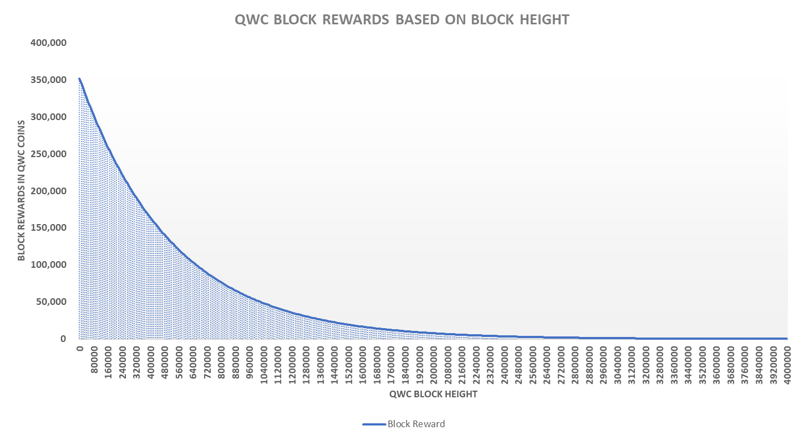
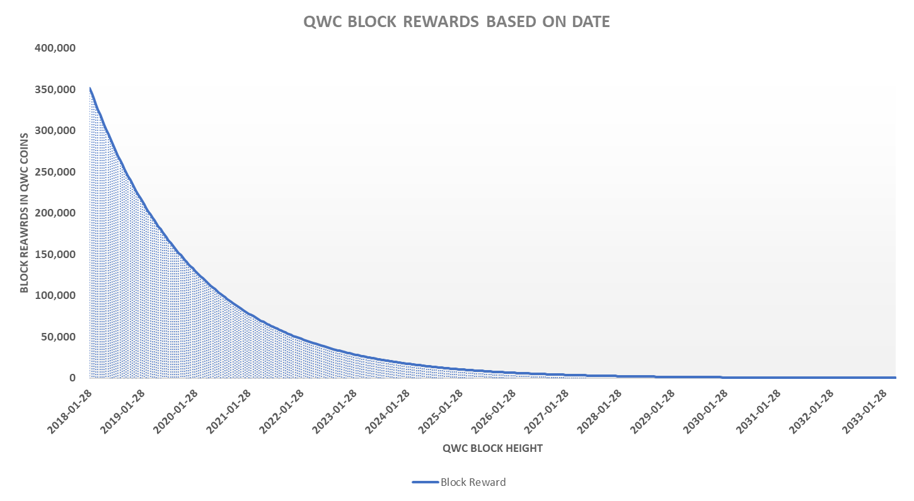

# CryptoNote Proof of Work

**How to Get Coins \[Mining\]: Default Proof of Work \(CryptoNote V2.0\)**

QWC blockchain project is an open-source project and is driven by community members. Anyone can join and support the network and get coins as compensation to their support through mining.

CryptoNote Technology V2.0 has a built-in block reward system called ‘emission rate’. It is a shape of log function and, because of its original design, **QWC block rewards will reduce by each block found and eventually reach a point called ‘tail emission’.**

QWC has an emission factor of 19. Please refer to below graphs to see how block rewards are reduced over time.

The default equation for calculating block rewards for CryptoNote is as follows:

Max. number of coins = \(2^64\) - 1, Number of decimals = 8, Emission factor = 19 

Block Reward \(or Base Reward\) 

= {\(\(2^64\) -1\) - \(already\_generated\_coins\*10^\(8\)\)}\*2^\(-19\)\*10^\(-8\)

\[Figure 1. Total QWC in Circulation per Bloch Height\]

\[Figure 2. Total QWC in Circulation per Date\]

\[Figure 3. Block Reward Reduction per Block Height\]

\[Figure 4. Block Reward Reduction per Date\]

* History of Mining Algorithm Changes

Qwertycoin core team is committed to reflecting the decisions of the community regarding major changes in the future through the community voting system.

Please go to our explorer page \([https://explorer.qwertycoin.org/\#pools](https://explorer.qwertycoin.org/#pools)\) and select a pool to mine from. Each pool provides information and a guide to set up for mining. Users can also mine with CPU using a built-in mining feature in QWC Desktop Wallet Software.

Make sure to create a wallet address before you start mining QWC.

